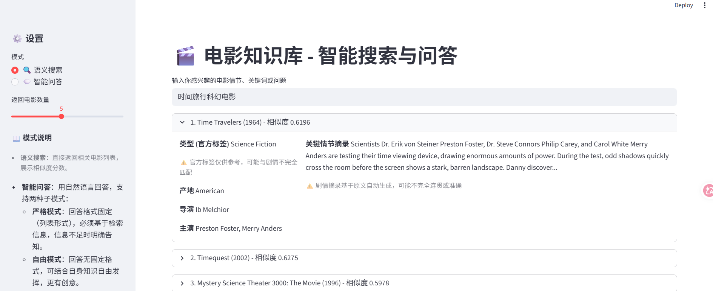
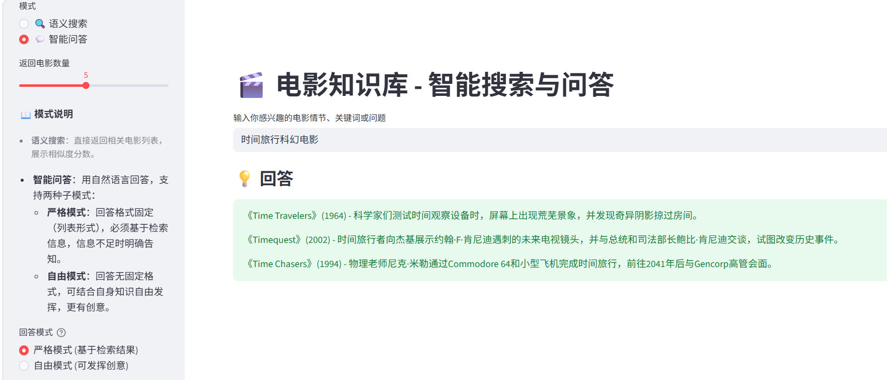

# 🎬 Movie-Mind-RAG: 电影智能搜索与问答系统

一个基于 RAG（检索增强生成）的电影知识库，支持**语义搜索**和**智能问答**。用户输入自然语言描述（如“时间旅行科幻电影”），系统可快速推荐相关电影，并提供基于大模型的深度问答。

---

## ✨ 核心功能

- **语义搜索**：根据剧情描述、关键词等返回最相关的电影列表（含标题、年份、产地、导演、主演、类型、剧情摘要）。
- **智能问答**：支持**严格模式**（仅基于检索结果）和**自由模式**（可发挥创意），调用大语言模型生成自然语言答案。
- **高质量中文摘要**：采用**位置加权 TextRank** 抽取式摘要 + **翻译（腾讯云API）**，确保剧情摘要连贯、信息完整且首句不丢失。
- **混合检索**：剧情向量检索 + 标题向量检索，通过 **RRF 融合** 排序；**标题完全匹配时强制置顶**，兼顾语义召回与精确匹配。
- **双表对齐架构（索引-元数据分离）**: 向量索引仅存储 `mvid_list`，元数据独立存储并维护，实现检索结果与详情信息的解耦，支持高效更新与扩展。 
- **可量化评估**：集成 **RAGAS 框架**，提供 `context_precision`、`context_recall`、`faithfulness`、`answer_relevancy` 等指标，客观衡量检索与生成质量。

---

## 🛠️ 技术栈

| 模块 | 技术 |
|------|------|
| 数据清洗 | Pandas, NumPy, re |
| 文本分块 | 手写 `SmartTextSplitter`（按句子边界/段落，块长 ≤800 字符，重叠 120） |
| 向量化 | SentenceTransformer (`paraphrase-multilingual-MiniLM-L12-v2`) |
| 向量索引 | FAISS（剧情索引 + 标题索引） |
| 检索优化 | RRF 融合、标题精确匹配硬置顶 |
| 摘要生成 | 位置加权 TextRank（强制保留第一句，`top_n=5`, `pos_weight=0.3`, `max_len=800`） |
| 离线翻译 | 翻译（腾讯云API） |
| 评估框架 | RAGAS 0.2.2（四指标） |
| 后端 API | FastAPI, Uvicorn |
| 前端界面 | Streamlit |
| 依赖管理 | uv / pip |

---

## 📁 项目结构

```
movie-mind-rag/
├── data/                         # 原始/中间数据（不提交）
├── index/                        # 向量索引和元数据（不提交）
│   ├── movie_plots.index         # 剧情 FAISS 索引
│   ├── title_index.index         # 标题 FAISS 索引
│   └── movie_metadata_tr_zh2000.pkl     # 最终元数据（含英文/部分中文摘要）
├── src/
│   ├── core/                     # 核心运行时模块
│   │   ├── retriever.py          # 检索器（剧情+标题，RRF融合，标题硬匹配）
│   │   ├── generator.py          # RAG 链（严格/自由模式）
│   │   ├── summarizer.py         # 抽取式摘要（LSA / TextRank）
│   │   └── smart_text_splitter.py  # 智能分块器
│   └── data/                     # 数据预处理模块
│       ├── data_cleaner.py       # 数据清洗（缺失值填充、重复处理、格式统一）
│       └── data_explorer.py      # 数据探索（分布统计、异常检测、字段质量分析）
├── scripts/                      # 离线构建/分块/翻译/评估脚本
│   ├── build_index.py            # 构建剧情索引
│   ├── build_title_index.py      # 构建标题索引
│   ├── data_converter.py         # 数据格式转换（csv->parquet）
│   ├── prepare_chunks.py         # 分块
│   ├── generate_summaries_tr.py     # 生成 TextRank 摘要
│   ├── translate_metadata_tengxun.py  # 腾讯云api翻译
│   └── evaluate_rag.py           # RAGAS 评估脚本
├── evaluation/                   # 测试集和评估结果
│   ├── data/                     # # 手工标注测试集 seed.csv（用于 RAGAS 评估） 
│   └── results/                  # RAGAS 输出（不提交）
├── config/settings.py            # 配置
├── api.py                        # FastAPI 后端
├── frontend.py                   # Streamlit 前端
├── requirements.txt
└── README.md
```

---

## 🚀 快速开始

### 1. 环境准备

```bash
git clone https://github.com/Ashley-Linn/movie-mind-rag.git
cd movie-mind-rag
python -m venv .venv
source .venv/bin/activate   # Linux/Mac
# .venv\Scripts\activate    # Windows
pip install -r requirements.txt
```
> **RAGAS 版本要求**：本项目评估脚本使用 RAGAS 0.2.2，请使用 `pip install ragas==0.2.2` 安装对应版本，以确保指标导入兼容。

### 2. 数据准备

(1) **下载原始数据集**  
   从 [Kaggle 维基百科电影剧情数据集](https://www.kaggle.com/datasets/jrobischon/wikipedia-movie-plots) 下载 `wiki_movie_plots_deduped.csv`（或从其他镜像获取）。

(2) **放置文件**  
   将下载的 CSV 文件放入 `data/` 目录下（如不存在请手动创建）。

(3) **数据清洗与分块**  
   运行以下命令生成清洗后的数据和分块文件：
   > 以下命令会自动生成 `data/processed/` 和 `index/` 目录（默认仓库无这些目录，需本地生成）。
   ```bash
   python src/data/data_cleaner.py
   python scripts/prepare_chunks.py   # 生成 chunks.parquet 和 metadata.parquet
   ```

### 3. 构建索引

```bash
# 构建剧情索引和元数据（默认使用 TextRank 摘要）
python scripts/build_index.py --chunks data/processed/chunks.parquet --metadata data/processed/metadata.parquet

# 构建标题索引（用于混合检索）
python scripts/build_title_index.py

```
### 4. 翻译中文摘要（可选）

```bash
# 使用腾讯云翻译 API（需配置密钥）
python scripts/translate_metadata_tengxun.py 
```

### 5. 启动服务

```bash
# 后端
uvicorn api:app --reload --port 8000

# 前端（新终端）
streamlit run frontend.py
```

访问 `http://localhost:8501` 开始使用。

---

## 📊 核心亮点与难点

- **脏数据处理**：清洗约 3.5 万条电影，处理缺失值、空字符串、重复记录，生成唯一 `mvid`。
- **智能分块**：按句子边界/段落切分，控制块长 500~800 字符，避免单词被切断；评估分块质量（长度分布、完整性）。
- **双表对齐架构（亮点）**：向量索引仅存储 `mvid_list`，元数据独立维护。检索时通过 `mvid` 映射获取详情，**彻底解耦索引与展示数据**。这使得：
  - 更新摘要、翻译、字段内容无需重建向量索引；
  - 支持多版本元数据并行（LSA / TextRank / 中英文）；
  - 检索逻辑与展示逻辑完全分离，易于扩展。
```
┌──────────┐    ┌─────────────────────────────┐
│ 用户查询  │    │       双表对齐架构           │
└────┬─────┘    │  ┌────────┐  ┌───────────┐  │
     ▼          │  │ FAISS  │  │ mvid_list │  │
┌──────────┐    │  │ 向量索引│→│ (序号→ID) │  │
│生成查询向量│───┼─▶└────────┘  └─────┬─────┘  │
└────┬─────┘    │                    ▼ (mvid) │
     ▼          │          ┌────────────────┐ │
┌──────────┐    │          │  movie_info    │ │
│ 返回结果  │←───┼──────────│ (ID→标题/摘要) │ │
└──────────┘    │          └────────────────┘ │
                └─────────────────────────────┘
```  
- **双路检索 + 标题置顶**：剧情向量 + 标题向量 RRF 融合；当查询与电影标题完全匹配时，该电影强制置顶，确保精准召回。
- **高质量摘要**：从 LSA 升级为 **位置加权 TextRank**，强制保留第一句话，`max_len=800`，显著提升连贯性和信息完整性。
- **混合模式问答**：严格模式（仅基于检索结果）与自由模式（可发挥创意）可切换，满足不同用户需求。
- **量化评估**：使用 RAGAS 评估检索与生成质量，支持持续迭代优化。

---

## 📝 配置说明

编辑 `config/settings.py` 可调整：

- `EMBEDDING_MODEL`：向量化模型
- `TOP_K`：默认返回电影数
- `SIMILARITY_THRESHOLD`：剧情检索阈值
- `LLM_MODEL`：大模型配置（如 deepseek-chat）
- `DEEPSEEK_API_KEY`：务必设置，建议使用环境变量。
- 评估相关阈值、路径等

---

## 📹 演示

### 语义搜索示例



### 智能问答示例（严格模式）



---

## 🙏 致谢

感谢开源社区和各位开发者的贡献。

---

## 📄 许可证

MIT License